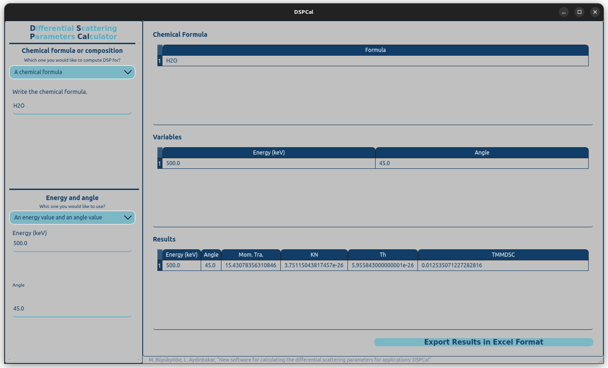

# DSPCal 

The **D**ifferential **S**cattering **P**arameters **Cal**culator: A small open-source software tool designed to calculate electron-photon scattering phenomena based on user input parameters. It can handle both single energy-angle pairs and multiple energy-angle ranges. The program provides detailed information such as momentum transfer, Klein-Nishina cross-section, Thomson cross-section, and total Mott differential scattering cross-section (TMMDSC).

https://youtu.be/iCgpg1YF8MU

[](https://www.youtube.com/watch?v=iCgpg1YF8MU&ab)

This work was originally written to support the following paper, submitted to a journal:

```
@article{Buyukyildiz2024,
title = "A new software tool for calculating the differential scattering parameters for applications: DSPCal",
journal = "...",
volume = "...",
pages = "...",
year = "2024",
issn = "...",
author = "M. Buyukyildiz and L. Aydinbakar"
}
```

To install the code and use on a computer with a Linux operating system you can clone this repository and run the following command on a terminal.

```
python3 dspcal.py
```

To use the program on a computer with a Windows operating system please send an email to `physics.calculation@gmail.com` using your email adress with `.edu` extension. Then, you will get a link to download the `DSPCal.exe` file.

